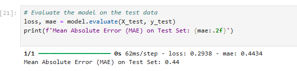
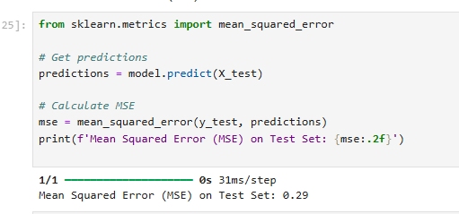
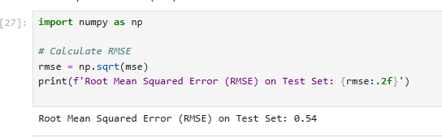
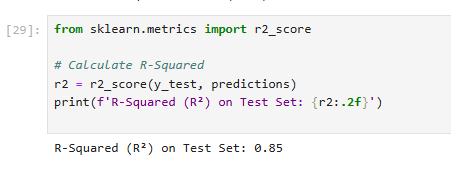

 <h1>Model evaluation</h1>
 <h1>Mean Absolute Error (MAE)</h1>
What it is: MAE measures the average magnitude of errors between predicted values and actual values, without considering their direction (i.e., it doesn't matter whether the prediction is too high or too low).
How to interpret: Lower MAE values indicate better predictive accuracy. If MAE = 0, it means your model's predictions are perfect.

<h1>Mean Squared Error (MSE)</h1>
What it is: MSE measures the average squared difference between the predicted values and the actual values. It penalizes larger errors more heavily than smaller ones.
How to interpret: Like MAE, lower MSE values are better. However, because it squares the errors, MSE is more sensitive to outliers.

<h1>Root Mean Squared Error (RMSE)</h1>
What it is: RMSE is the square root of MSE, bringing the error metric back to the same unit as the original output variable. It gives a sense of the magnitude of errors.
How to interpret: Lower RMSE values indicate better predictive accuracy. RMSE is useful when you want to understand the error in the context of the data's scale.

<h1>R-Squared</h1>

What it is: R-Squared, or the coefficient of determination, indicates the proportion of the variance in the dependent variable that is predictable from the independent variables.
How to interpret: 
  values range from 0 to 1, where: 
  R-Square =1: The model explains all the variability in the data (perfect fit).
  R-Square=0: The model explains none of the variability in the data.
 Negative values are possible if the model performs worse than a horizontal line (mean of the data).

 
